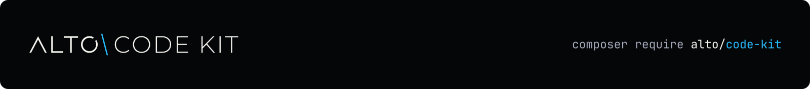

<h1 align="center">
  <a href="https://altophp.com/code-kit">
    
  </a>
</h1>

Compose source slicing and semantic highlighting into immutable annotated code snippets.

<p align="center">
  
  
  <a href="https://packagist.org/packages/alto/code-kit"></a>
  
  <a href="https://github.com/sponsors/smnandre"></a>
</p>

Code Kit connects Code Slicer, Code Highlight, and Code Snippet. It selects source code, derives semantic
syntax annotations, and returns a renderer-independent snippet while preserving source context.

```php
use Alto\Code\Kit\CodeKit;
use Alto\Code\Slicer\CodeSource;

$slice = CodeSource::fromFile('src/Command/BuildCommand.php')
    ->slice()
    ->method('execute');

$snippet = (new CodeKit())
    ->snippet($slice)
    ->dedent();
```

## Installation

Install ALTO CodeKit with Composer:

```bash
composer require alto/code-kit
```

Code Kit requires PHP 8.4 or later. It installs Code Slicer, Code Highlight, and Code Snippet.

## Complete-source parsing

Code Kit parses the complete source before projecting the selected range. Context-sensitive syntax
therefore remains correct when a slice starts inside a docblock, string, heredoc, or embedded
language.

```php
$snippet = (new CodeKit())->snippet(
    CodeSource::fromFile('src/Example.php')->lines(24, 32),
);
```

The resulting `CodeSnippet` keeps its source name, original line numbers, language, and syntax
annotations.

A single line needs no surrounding output context:

```php
$line = (new CodeKit())->snippet(
    CodeSource::fromString($code, 'php')->lines(24, 24),
);
```

## Existing snippets

Use `annotate()` when a snippet already exists:

```php
use Alto\Code\Snippet\CodeSnippet;

$snippet = CodeSnippet::fromCode('$total = array_sum($prices);', 'php');
$annotated = (new CodeKit())->annotate($snippet);
```

Existing metadata, selections, and annotations remain available. Each added `syntax` annotation
contains the semantic `scope` and `tokenType` supplied by CodeHighlight. Whitespace is left
unannotated.

## Package boundary

Code Kit owns orchestration only. Code Slicer locates source ranges, Code Highlight parses syntax, and
Code Snippet carries the immutable result. Rendering to HTML, SVG, PNG, terminals, or slides belongs
to consumers.

Read the [documentation](docs/index.md), then continue with
[Installation](docs/installation.md) and [Getting started](docs/getting-started.md).

## Contributing

Contributions of all kinds are welcome. Visit the
[project on GitHub](https://github.com/altophp/code-kit) to
[report a bug](https://github.com/altophp/code-kit/issues/new),
[suggest a feature](https://github.com/altophp/code-kit/issues/new), or
[open a pull request](https://github.com/altophp/code-kit/pulls).

Before submitting code, run:

```bash
# Runs PHP CS Fixer, PHPStan, and PHPUnit
composer qa
```

Changes to public behavior should include tests and documentation.

## Support

ALTO Code Kit is open source and independently maintained by
[Simon André](https://smnandre.dev). If it is useful to your work, you can
support its continued development through
[GitHub Sponsors](https://github.com/sponsors/smnandre).

Sharing the package or
[starring it on GitHub](https://github.com/altophp/code-kit) also helps.

## License

ALTO Code Kit is released by [ALTO PHP](https://altophp.com) under the
[MIT License](LICENSE).
